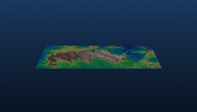

# 🏔️ 3D Visualization of Digital Elevation Models

Python pipeline to generate 360° rotation videos, orthogonal nadir views, and interactive exploration from any DEM in a projected CRS. No map frame, no GUI, no black box.


<div align="center">



</div>

## 🎯 What this pipeline does

Three complementary ways to visualize a DEM, all from the same GeoTIFF file:

- 🎬 **360° rotation video** (`dem_rotacao_video.py`) — camera orbiting the terrain, configurable vertical exaggeration, MP4 H.264 encoding
- 🛰️ **Orthogonal nadir view** (`render_cenital.py`) — plan view of the relief with hillshading, no perspective distortion
- 🖱️ **Interactive viewer** (`view_3d.py`) — navigable window with mouse and keyboard, to inspect the DEM before rendering

All three scripts follow the same configuration pattern — file path, optional clipping, vertical exaggeration — and work for any DEM in a projected coordinate system (UTM, Albers, etc.). This repository uses the Chapada do Araripe DEM as a demonstration case, with the corresponding outputs in [`outputs/`](outputs/).

## 🛠️ Tech stack

- **`rasterio`** — reading and clipping the GeoTIFF raster
- **`scipy`** — Gaussian smoothing of the relief
- **`pyvista`** — building the 3D mesh and shading with fixed NW illumination
- **`imageio-ffmpeg`** — MP4 video encoding (H.264)

## 🚀 How to run

Prerequisites: Python 3.10+ and `pip`.

```bash
# Clone the repository
git clone https://github.com/marcuspaiv/<repo-name>.git
cd <repo-name>

# Create and activate the virtual environment
python -m venv .venv
.\.venv\Scripts\Activate.ps1     # Windows PowerShell
# source .venv/bin/activate      # Linux/macOS

# Install dependencies
pip install rasterio scipy pyvista imageio-ffmpeg
```

In each script, update `DEM_PATH` to point to your `.tif` file and adjust `CLIP_BBOX` and `EXAGERO` according to the area and the relief. Then:

```bash
python dem_rotacao_video.py     # 360° rotation video
python render_cenital.py        # orthogonal nadir view
python view_3d.py               # interactive viewer
```

**DEM requirements:** GeoTIFF in a projected coordinate system (meters). For DEMs in geographic coordinates (degrees), reproject to UTM or another CRS in meters first — the scripts emit a warning, but if ignored the output will have an incorrect vertical scale.

**Quick guide to vertical exaggeration:**

| Relief type | Suggested EXAGERO |
|---|---|
| Strong over a small area (mountain ranges, canyons) | 1.0 – 1.5 |
| Moderate over a medium area (plateaus, tablelands) | 2.0 – 3.0 |
| Subtle over a large area (plains, basins) | 3.5 – 6.0 |

## 🗺️ Demonstration case: Chapada do Araripe

The Chapada do Araripe, on the border between the states of Ceará, Pernambuco, and Piauí, is a plateau that endured while the surrounding terrain was lowered by erosion over millions of years. Geologically, it is a remnant of a Cretaceous sedimentary basin, whose Crato and Santana formations are among the most important fossil deposits on the planet — the region is home to the first UNESCO-recognized geopark in the Americas.

The pipeline was applied to the Chapada DEM, producing the artifacts below:

| File | Description |
|---|---|
| `outputs/araripe_rotacao_3d.mp4` | 360° rotation video — 24 s · 1920×1080 · H.264 |
| `outputs/araripe_cenital.png` | Orthogonal nadir view with hillshading |

**DEM data used:**
- Source: [Copernicus Global Digital Surface Model (GLO-30)](https://spacedata.copernicus.eu/collections/copernicus-digital-elevation-model)
- Resolution: 30 × 30 m
- Projection: SIRGAS 2000 / UTM 24S (EPSG:31984)
- Clip: 200 × 80 km, elevation range 286 – 1,004 m

## 📂 Repository structure

```
.
├── outputs/
│   ├── araripe_cenital.png
│   ├── araripe_rotacao_3d.mp4
│   └── preview.png
├── dem_rotacao_video.py
├── render_cenital.py
├── view_3d.py
├── .gitignore
├── LICENSE
└── README.md
```

## 📝 Technical notes

- **Fixed NW illumination** produces hillshading with consistent shadows. In the rotation video, the "sunlight" does not follow the camera — each face of the relief is shown under varying illumination depending on the angle, as it would happen in the field.
- **Decimation by 2** on the visualized mesh (half the resolution of the original DEM) keeps rendering performance high with no perceptible visual loss.
- **Percentile clipping (0.5–99.5)** on elevation for robustness against outliers and nodata, without distorting the actual relief range.

## 👤 Author

**Marcus Paiva** — Geologist · M.Sc. in Petroleum Geology (UNICAMP)

<p>
  <a href="https://www.linkedin.com/in/marcus-paiva-b10339186/" target="_blank">
    
  </a>
  <a href="mailto:<marcuspaiv@hotmail.com>">
    
  </a>
  <a href="https://github.com/marcuspaiv" target="_blank">
    
  </a>
</p>

## 📄 License

MIT — free to use with attribution.
