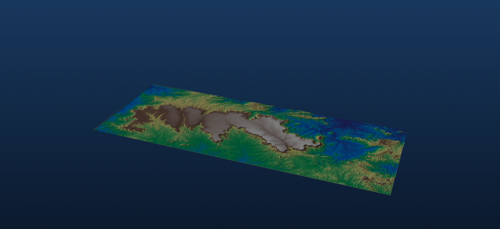

# Visualização 3D de Modelos Digitais de Elevação

Pipeline em Python para gerar vídeos de rotação 360°, vistas cenitais ortogonais e exploração interativa a partir de qualquer DEM em CRS projetado. Sem moldura cartográfica, sem GUI, sem caixa-preta.

<p align="center">
  
</p>

## O que esse pipeline faz

Três formas complementares de visualizar um DEM, todas a partir do mesmo arquivo GeoTIFF:

- **Vídeo de rotação 360°** (`dem_rotacao_video.py`) — câmera orbitando o terreno, exagero vertical configurável, codificação MP4 H.264
- **Vista cenital ortogonal** (`render_cenital.py`) — plan view do relevo com hillshading, sem distorção em perspectiva
- **Visualizador interativo** (`view_3d.py`) — janela navegável com mouse e teclado, para inspecionar o DEM antes de renderizar

Os três scripts seguem o mesmo padrão de configuração — caminho do arquivo, recorte opcional, exagero vertical — e funcionam para qualquer DEM em sistema de coordenadas projetado (UTM, Albers, etc.). Este repositório usa o DEM da Chapada do Araripe como caso de demonstração, com as saídas correspondentes em [`outputs/`](outputs/).

## Stack técnica

- **`rasterio`** — leitura e recorte do raster GeoTIFF
- **`scipy`** — suavização gaussiana do relevo
- **`pyvista`** — construção da malha 3D e sombreamento por iluminação fixa a NW
- **`imageio-ffmpeg`** — codificação do vídeo MP4 (H.264)

## Como executar

Pré-requisitos: Python 3.10+ e `pip`.

```bash
# Clonar o repositório
git clone https://github.com//.git
cd 

# Criar e ativar o ambiente virtual
python -m venv .venv
.\.venv\Scripts\Activate.ps1     # Windows PowerShell
# source .venv/bin/activate      # Linux/macOS

# Instalar dependências
pip install rasterio scipy pyvista imageio-ffmpeg
```

Em cada script, atualize `DEM_PATH` para apontar para o seu arquivo `.tif` e ajuste `CLIP_BBOX` e `EXAGERO` conforme a área e o relevo. Depois:

```bash
python dem_rotacao_video.py     # vídeo de rotação 360°
python render_cenital.py        # vista cenital ortogonal
python view_3d.py               # visualizador interativo
```

**Requisitos do DEM:** GeoTIFF em sistema de coordenadas projetado (metros). Para DEMs em coordenadas geográficas (graus), reprojete antes para UTM ou outro CRS em metros — os scripts emitem um aviso, mas se ignorado o resultado sai com escala vertical incorreta.

**Guia rápido do exagero vertical:**

| Tipo de relevo | EXAGERO sugerido |
|---|---|
| Forte em área pequena (cordilheiras, cânions) | 1,0 – 1,5 |
| Moderado em área média (chapadas, planaltos) | 2,0 – 3,0 |
| Discreto em área grande (planícies, bacias) | 3,5 – 6,0 |

## Caso de demonstração: Chapada do Araripe

A Chapada do Araripe, na divisa entre Ceará, Pernambuco e Piauí, é um platô que resistiu enquanto o terreno ao redor foi rebaixado pela erosão ao longo de milhões de anos. Geologicamente, é um remanescente de uma bacia sedimentar do período Cretáceo, cujas formações Crato e Santana estão entre os depósitos fossilíferos mais importantes do planeta — a região abriga o primeiro geoparque das Américas reconhecido pela UNESCO.

O pipeline foi aplicado ao DEM da Chapada gerando os artefatos abaixo:

| Arquivo | Descrição |
|---|---|
| `outputs/araripe_rotacao_3d.mp4` | Vídeo de rotação 360° — 24 s · 1920×1080 · H.264 |
| `outputs/araripe_cenital.png` | Vista cenital ortogonal com hillshading |

**Dados do DEM utilizado:**
- Fonte: [Copernicus Global Digital Surface Model (GLO-30)](https://spacedata.copernicus.eu/collections/copernicus-digital-elevation-model)
- Resolução: 30 × 30 m
- Projeção: SIRGAS 2000 / UTM 24S (EPSG:31984)
- Recorte: 200 × 80 km, faixa de elevação 286 – 1.004 m

## Estrutura do repositório

```
.
├── outputs/
│   ├── araripe_cenital.png
│   ├── araripe_rotacao_3d.mp4
│   └── preview.png
├── dem_rotacao_video.py
├── render_cenital.py
├── view_3d.py
├── .gitignore
├── LICENSE
└── README.md
```

## Notas técnicas

- **Iluminação fixa a NW** gera hillshading com sombras coerentes. No vídeo de rotação, a "luz solar" não acompanha a câmera — cada face do relevo é mostrada sob iluminação variável conforme o ângulo, como aconteceria no campo.
- **Decimação por 2** na malha visualizada (metade da resolução do DEM original) mantém o desempenho de renderização sem perda visual perceptível.
- **Clipe por percentil (0,5–99,5)** na elevação para robustez contra outliers e nodata, sem distorcer a faixa real do relevo.

## Autor

**M. Paiva** — Geologia  
[LinkedIn](https://www.linkedin.com/in/<seu-perfil>)

## Licença

MIT — uso livre com atribuição.
